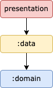

# Weather App

This is the guide about how this app was developed.
**This App running with Java Version_17**

The app was developed with latest modern android development :
- ***Kotlin***
- ***Jetpack Compose***
- ***Clean Architecture pattern***
- ***Hilt - Dependency Injection***
- ***Coroutines***
- ***Flow***
- ***Room***
- ***Version Catalog***
- ***Android Min SDK: 24***
- ***Android Target SDK: 33***
- ***Min Android Version: VERSION_17***

## Android App Architecture - Guideline to App Architecture

**Top tip**: A module graph (shown above) can be useful during modularization planning for
visualizing dependencies between modules.

The Weather app contains the following types of modules:

* The `presentation` module - contains presentation layer that contains ViewModel, Navigation Graph and Composable Function.
* `data` module - contains operation about accessing or manipulating data both network nor local.
  This module depend on `domain` module, but it shouldn’t depend on `presentation` module.
* `domain` module - most deep layer that contains all business logic for each specific usecase, such as `GetForecastUseCase`, `AddCityUseCase`, etc. This module not depend to any module, because this is the deepest layer based on Clean Architecture guidelines.
* `di` module - contains scaffolding classes that bind the rest of codebases.
* `utils` module - basically common module that contains extension function, helper, or constant data.

## Main Features
- Show all cities saved
- Add new city to storage
- Show detail forecast for each city

## Demo :)

## Credits
- **Dimas Arya Murdiyan** - dimasaryamurdiyan123@gmail.com
- [Open Weather API](https://openweathermap.org/api)